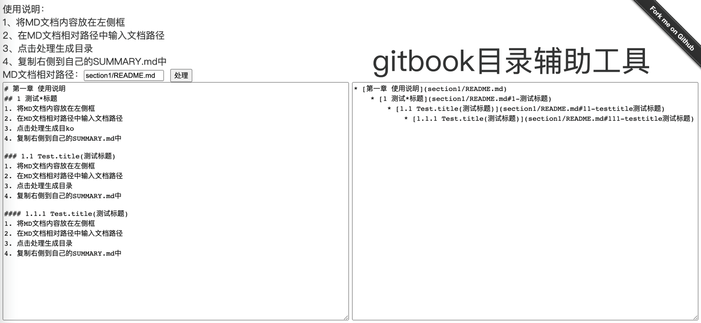

# gitbook-summary-util
gitbook summary.md 编写辅助工具

文章参考：https://blog.jisuye.com/2020/03/11/gitbook_summary/

使用说明：  
1、将MD文档内容放在左侧框  
2、在MD文档相对路径中输入文档路径  
3、点击处理生成目录  
4、复制右侧到自己的SUMMARY.md中  

直接使用地址：http://blog.jisuye.com/gitbook-summary-util/
